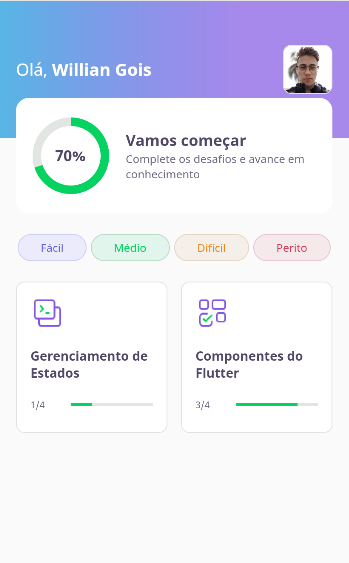

<p align="center">	
   <a href="https://www.linkedin.com/in/willian-gois/">
      
   </a>

  <a aria-label="Completed" href="https://nextlevelweek.com/episodios/flutter/1/edicao/5">
    </img>
  </a>

  
</p>

<div align="center">
    <a href="#sparkles-sobre">Sobre</a>&nbsp;|&nbsp;
    <a href="#rocket-tecnologias">Tecnologias</a>&nbsp;|&nbsp;
    <a href="#computer-executando-o-projeto">Executando o projeto</a>&nbsp;|&nbsp;
    <a href="#pencil-licença">Licença</a>
 </div>

 <div align="center">
   
</div>

## :sparkles: Sobre
:rocket: **Dev.Quiz** é uma aplicação Flutter (mobile, web e desktop) desenvolvida para ajudar na aprendizagem de estudantes de Flutter, onde reune quizzes com perguntas e respostas sobre temas relacionados ao SDK da Google e seu ambiente.

Aplicação desenvolvida durante a [**Next Level Week #5**](https://nextlevelweek.com/episodios/flutter/1/edicao/5), pela trilha Flutter, projeto da [Rocketseat](https://rocketseat.com.br), que consiste em uma semana (19 à 25 de abril) de estudos, networking e programação.

Para o desenvolvimento, foi utilizado a linguagem Dart e o kit de desenvolvimento para criação de aplicativos compilados nativamente, o Flutter, ambos mantidos pela Google.

---

## :rocket: Tecnologias
-  [Flutter](https://flutter.dev)
-  [Dart](https://dart.dev)

---

## :computer: Executando o projeto
``` bash
# Clonar o repositório
git clone https://github.com/willgoix/dev-quiz

# Entrar na raíz do projeto
cd dev-quiz

# Instalar as dependências
flutter pub get

# Executar a aplicação
flutter run
```

## :pencil: Licença

Este projeto está sobre a [MIT license](./LICENSE).

<div align="center">
  <sub>Desenvolvido com 💜 por <a href="https://github.com/willgoix">Willian Gois</a>.</sub>
</div>
